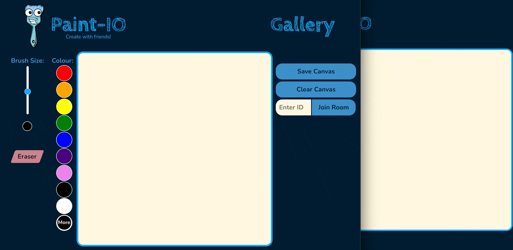
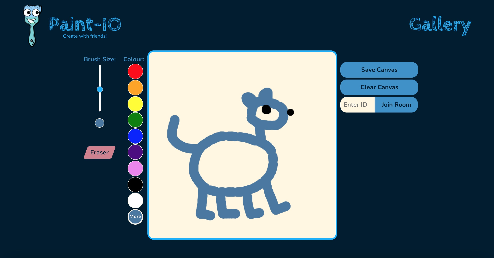
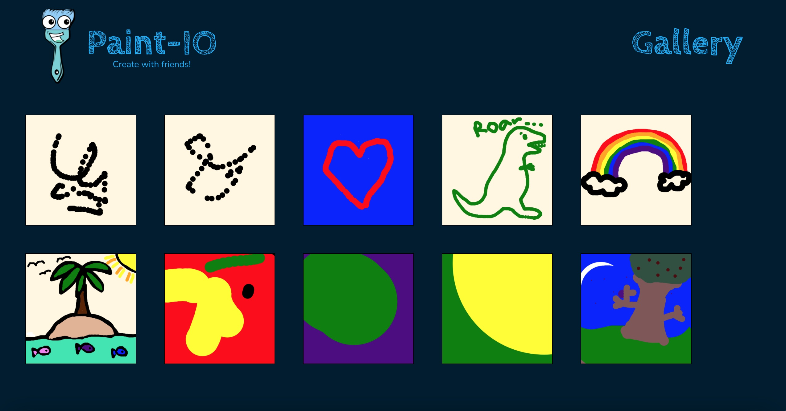

<h1 align="center">
  
   
  Mintbean Hackathon November 2021: Paint App
</h1>

### Table of Contents

- [Introduction](#introduction)
- [Technologies Used](#technologies-used)
- [The Team](#the-team)
- [Screenshots](#screenshots)

## Introduction

This project was built for a weeklong hackathon run by [Mintbean](https://mintbean.io/). The challenge was to build a full-stack paint app, and we decided to make ours a collaborative app using sockets. Multiple people can join the same room to draw together on the same canvas. We incorporated standard drawing tools such as selector tools for colour and brush size, an eraser, and a clear canvas button. The users can also save their drawings to the gallery, which can be viewed by anyone.

Visit the [live demo on Heroku](https://paint-io.herokuapp.com/) to try it out, or visit the [landing page](https://danibarker.github.io/paintIO/) for more information about the project.

## Technologies Used

- Node
- Express
- MongoDB
- React
- Socket.IO

## The Team

- Danielle Barker
    - [LinkedIn](https://www.linkedin.com/in/danielle-ej-barker/)
    - [Portfolio](https://danibarker.github.io/portfolio)
- Christy Clement 
    - [LinkedIn](https://www.linkedin.com/in/christy-clement/)
    - [Portfolio](https://christyc01.github.io/)

## Screenshots

